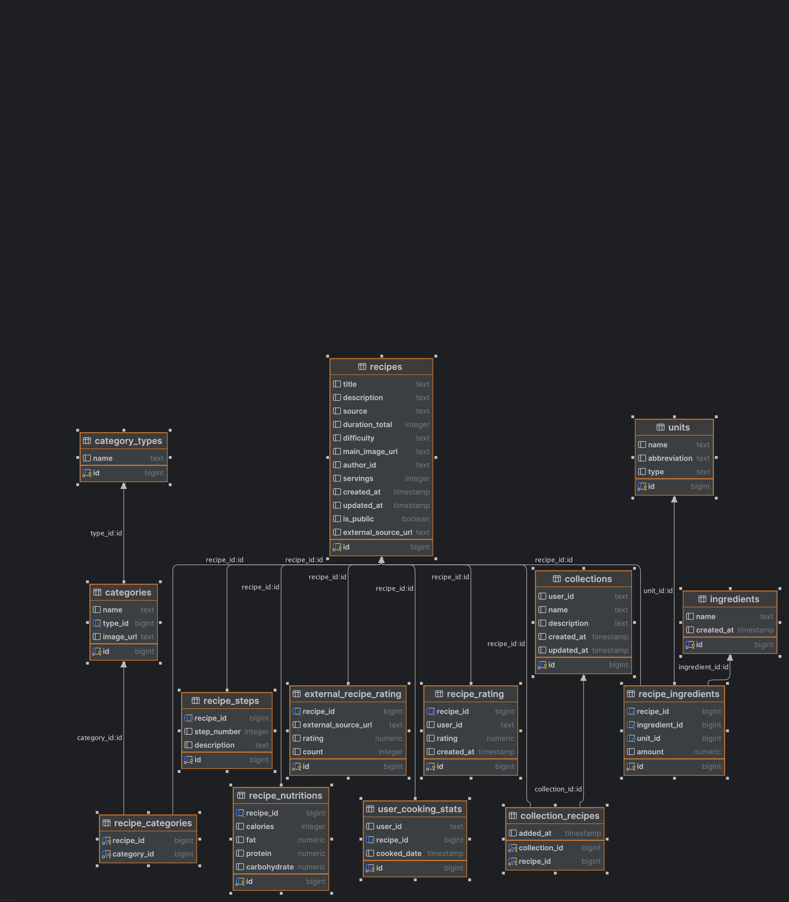

# Cats Cookapp

## Overview

This project is built with Spring Framework and requires Java Development Kit (JDK) to run. It is designed to perform
the following tasks:

- **Save and return recipes for mobile applications**: The project provides an API that allows mobile applications to
  save and retrieve recipes.
- **Save and return user information**: The project provides an API that allows mobile applications to save and retrieve
  user information.
- **Save and return user preferences**: The project provides an API that allows mobile applications to save and retrieve
  user preferences.

## Prerequisites

- **JDK**: This project is tested with JDK 19. Make sure you have JDK 19 or later installed on your system. You can
  download it from [Oracle's official site](https://www.oracle.com/java/technologies/javase-jdk11-downloads.html).
- **Environment Variables**: Before running the project, you need to obtain a `.env` file that contains all the
  necessary environment configurations. Contact the project administrator or refer to the project documentation to
  acquire this file.

## Setup

1. **Clone the repository**
2. **Install dependencies**: Run the following command to install all the dependencies required for the project:
    ```shell
    mvn install
    ```
   or right-click on the project in your pom.xml file and select `Maven` > `Reload Project`.

## DB Schema

 
